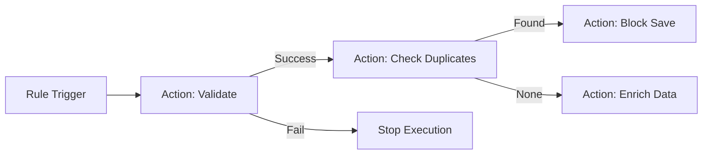

# Bolton Rule Engine

**Enterprise-Grade Rule Engine & Data Quality Framework for Frappe/ERPNext**

Bolton transforms how you manage business logic in ERPNext. Instead of hardcoding logic in Python hooks, define flexible **Rules** that run validations, deduplication, and data enrichment dynamically.

## 🚀 Key Features

*   **Graph-Based Execution**: Compose complex logic flows using a visual graph of actions.
*   **Process Methods**: Extensible units of logic (Python functions) that plug into any rule.
*   **No-Code Configuration**: Configure logic using JSON schemas - the UI automatically adapts to the method's requirements.
*   **Data Quality**: built-in deduplication (fuzzy matching, child table checks) and normalization.
*   **Safe Execution**: Sandboxed environment with timeouts and error handling.

## 🏗️ Architecture

The system is built on three core pillars:

1.  **Rule (`Rule`)**: The trigger configuration (Link to DocType, Event, Filters).
2.  **Rule Action (`Rule Action`)**: A step in the rule's execution graph. Links to a *Process Method*.
3.  **Process Method (`Process Method`)**: The actual code definition (e.g., `validate_email`, `find_duplicates`).



## 🛠️ Usage

### 1. Creating a Process Method (Developer)

Define a Python function and register it as a `Process Method` DocType.

**Code:**
```python
# bolton/ruleflow/methods/custom.py
def check_credit_limit(context, limit=0, **kwargs):
    doc = context.get('doc')
    if doc.grand_total > limit:
         return False
    return True
```

**Fixture (process_method.json):**
```json
{
    "method_path": "bolton.ruleflow.methods.custom.check_credit_limit",
    "config_schema": "{\"fields\": [{\"fieldname\": \"limit\", \"fieldtype\": \"Currency\", \"label\": \"Max Amount\"}]}",
    "return_type": "Boolean"
}
```

### 2. Configuring a Rule (User)

Create a **Rule** document:
*   **DocType**: `Sales Order`
*   **Event**: `Before Save`
*   **Actions**:
    *   **Label**: Check Credit
    *   **Method**: `Check Credit Limit`
    *   **Configuration**: `{ "limit": 5000 }` (UI generated from schema)
    *   **Action ID**: `CREDIT_CHECK`

### 3. Data Mapping (Inputs/Outputs)

Pass data between the Rule Context and Process Methods dynamically.

*   **Input Mapping**: map context variables to function arguments.
    *   `{"customer_grade": "grade"}` -> Passes `context['customer_grade']` as `grade` argument.
*   **Output Mapping**: Store function results back into context.
    *   `{"is_valid": "check_passed"}` -> Stores result in `context['check_passed']`.

## 📦 Contact Deduplication

Bolton includes powerful deduplication out-of-the-box.

**Scenario**: Prevent saving a Contact if their phone number exists on *any* other contact.

1.  Create Rule for **Contact** on **Before Save**.
2.  Add Action: **Find Duplicates in Child Table**.
3.  Configuration:
    *   **Child Table**: `phone_nos`
    *   **Child Field**: `phone`
4.  Add Action: **Prevent Duplicate Save** (if previous step returns list).

## 📥 Installation

```bash
# 1. Get the App
bench get-app bolton [git-url]

# 2. Install Dependencies
./env/bin/pip install jsonschema rapidfuzz

# 3. Install to Site
bench --site [sitename] install-app bolton

# 4. Migrate (loads fixtures)
bench --site [sitename] migrate
```


 